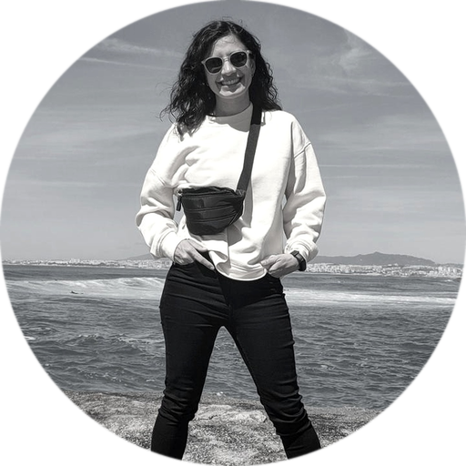

::::: columns
::: {.column width="30%"}

{.profile-pic}

:::

::: {.column width="70%"}

I’m Anabella Molina, a political scientist, PhD in Social Sciences (University of Buenos Aires) and MA in Political Science (Universidad Torcuato Di Tella). My work sits at the intersection of gender, political institutions, and empirical evidence, with a focus on Latin America.

Beyond my academic work, I take part in applied research projects and institutional coordination, building partnerships among organizations, local governments, and universities. Methodologically, I work with survey design, comparative methods, QCA, and R.

You can find my publications, teaching, talks, and CV in the sections of this website.\
Download my CV (PDF).

### Work stack

R · Quarto · Git/GitHub · Tidyverse · Reproducibility · Open data

### Interests

- Gender and executive power; cabinets and ministerial recruitment
- Institutions, parity rules, and political representation
- Comparative politics in Latin America
-Methods: QCA, surveys, mixed-methods analysis, and R

### Education

- PhD in Social Sciences — University of Buenos Aires (2025)
- MA in Political Science — Universidad Torcuato Di Tella (2021)
- BA in Political Science — University of Buenos Aires (2013)

### Research stays

- University of Lisbon — Research stay (2020)
- University of Lisbon — Research stay (2023)

:::
:::::
